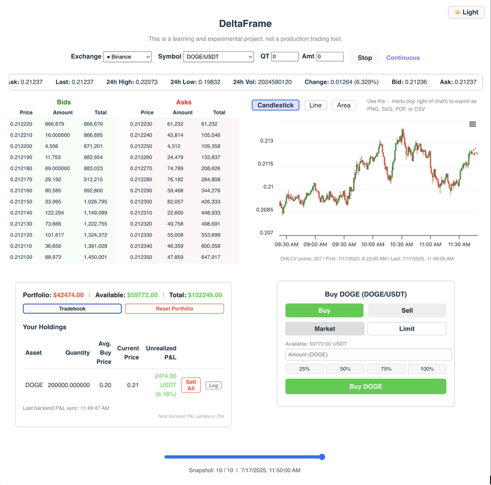

# DeltaFrame Pro

**DeltaFrame Pro** is an open-source, full-stack crypto order book and trading simulation platform. It's not a finished product or a professional trading tool—it’s a learning sandbox. A place where I explore, experiment, and grow as a full-stack developer with a focus on fintech.

> TL;DR: Still not a product. Still not a tool. Just a chaos-driven learning project that’s gotten cleaner, smarter, and a bit more serious—with a name to match.

---

## Why DeltaFrame Pro?

This is a new version, split into a separate repo to mark a new chapter. The original **DeltaFrame** taught me a ton, but **DeltaFrame Pro** represents a more focused push toward UI/UX quality, modular architecture, and thoughtful feature design—while keeping the FAFO spirit alive.

---

## Project Philosophy

Built on the FAFO model — _"fuck around and find out"_ — this project is a journal of learning by doing. I’ve broken and rebuilt nearly every part of this app, and each iteration taught me something new.

---

## What’s New in DeltaFrame Pro

### 1. Sidebar Navigation
- Modern, persistent sidebar with icon-labeled pages: **Dashboard**, **Portfolio**, **Order Book**, **About**, and **Settings**
- Collapsible for focus, with active page highlighting

### 2. Modular Pages
- **Dashboard:** Unified landing page with live market view, trading panel, and P&L
- **Portfolio:** Deep dive into holdings, allocation, and trade insights
- **Order Book:** Full-screen view of the order book and depth chart
- **About:** Explains project intent, FAFO method, and development journey
- **Settings:** Houses theme toggle, logout placeholder, and user preferences

### 3. Theme & Appearance
- **Sidebar Theme Toggle:** Moved to the sidebar’s footer for consistency
- **Persistent & Responsive:** Respects system preferences, remembers your theme
- **Clean & Responsive UI:** Mobile-friendly, accessible, minimal

### 4. Defensive UX & Stability
- No crash policy: UI doesn’t break on bad/missing data
- Helpful placeholder content and user guidance
- All errors are caught and shown with clarity, not cryptic stack traces

### 5. Trading & Portfolio Enhancements
- **Hybrid P&L Engine:** Real-time frontend P&L verified by backend
- **Tradebook Modal:** Full trade history, sortable/filterable
- **Dynamic Holdings:** Derived from trade history—no redundant tables
- **Reset Portfolio:** One-click wipe to restart your sim-trading journey

### 6. Charting & Market Visuals
- Highcharts integration with candlestick, line, and area modes
- Export options (PNG, SVG, PDF, CSV)
- **Depth Chart** and **Order Book Imbalance**: Visual cues for market depth

### 7. Technical & Architectural Upgrades
- Modular React components for each page
- Clean separation of frontend (React + Vite) and backend (Node.js + Express + Sequelize)
- SQLite database with refactored schema and improved integrity
- Expanded API: `exchanges`, `symbols`, `orderbook`, `trades`, `holdings`, `balance`, `ticker`, `snapshots`

---

## Screenshots


*A cleaner, more structured version of the original vision. Live order book, simulated trades, verified P&L—all in one place.*

---

## Features Overview

| Feature                | Details                                                                 |
|------------------------|-------------------------------------------------------------------------|
| **Live Order Book**     | Real-time from CCXT, with depth and imbalance charts                   |
| **Interactive Charts**  | Candlestick, zoom/pan, export, light/dark mode                         |
| **Trading Simulation**  | Buy/sell with real-time feedback, state stored in SQLite               |
| **Dynamic Holdings**    | Recomputed from trade history for consistency                          |
| **Verified P&L**        | Frontend vs backend mismatch detection                                 |
| **Sidebar Navigation**  | Modular page layout with clear structure and focus                     |
| **Error Handling**      | Defensive UI—no crashes, no blanks                                     |
| **Responsive UI**       | Works well on all screen sizes; accessible design                      |

---

## Previous Projects

Each iteration got me closer to something usable and educational:

1. [orderbook-viewer](https://github.com/vedang-patil-23/orderbook-viewer) – very early raw implementation
2. [orderbook-explorer](https://github.com/vedang-patil-23/orderbook-explorer) – more data and depth
3. [orderbook-vision](https://github.com/vedang-patil-23/orderbook-vision) – focused on UI prototyping
4. [DeltaFrame](https://github.com/vedang-patil-23/DeltaFrame) – the original base for DeltaFrame Pro

---

## Getting Started

1. **Install dependencies** (in both frontend and backend):
   ```bash
   npm install
```

2. **Start the backend:**

   ```bash
   cd backend && npm run dev
   ```

3. **Start the frontend:**

   ```bash
   cd frontend && npm run dev
   ```

4. **Visit the app:**
   Open [http://localhost:5173](http://localhost:5173) in your browser

---

## License

MIT — for learning and non-commercial use

---

## Final Thoughts

This project isn't a product—it's a checkpoint. A growing, chaotic, and honest representation of learning in public. If you’ve got feedback, ideas, or just want to chat fintech and dev journeys, feel free to reach out.

**Thanks for exploring DeltaFrame Pro.** Onward to the next iteration. 