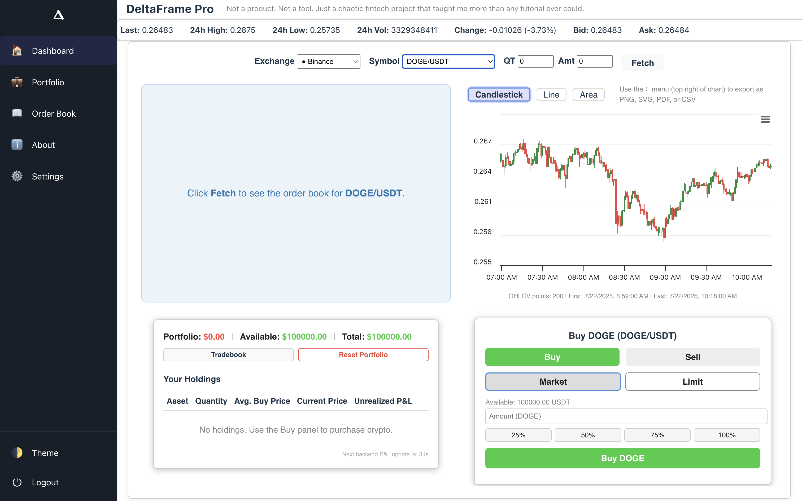
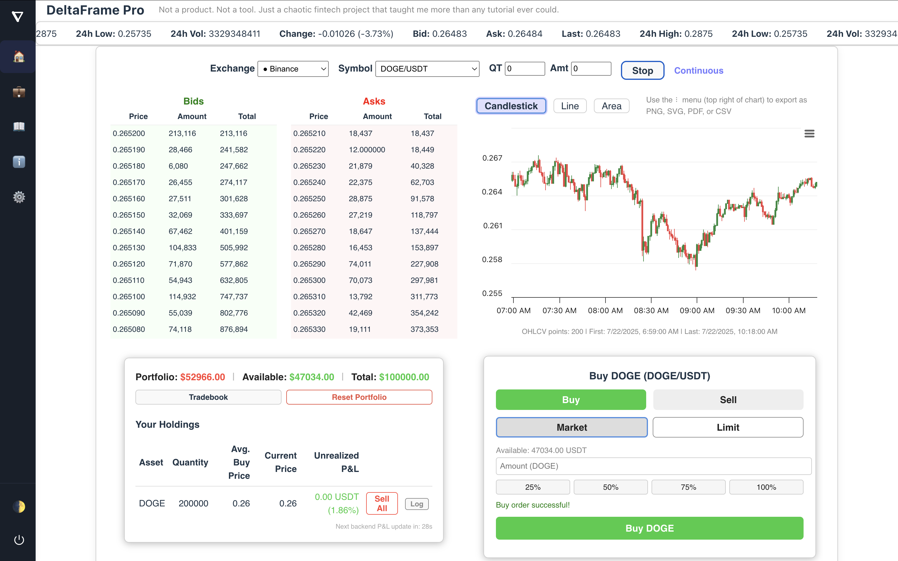

# DeltaFrame Pro

**DeltaFrame Pro** is a comprehensive, open-source, full-stack crypto order book and trading simulation platform. While it is not a finished product or a professional trading tool, it serves as a robust learning sandbox—a place to explore, experiment, and grow as a full-stack developer with a focus on fintech. The project is a living record of iterative improvement, technical curiosity, and the pursuit of best practices in both backend and frontend engineering.

> TL;DR: DeltaFrame Pro is not a commercial product or a trading tool. It is a continuously evolving, chaos-driven learning project that has become cleaner, smarter, and more modular over time. The "Pro" in the name reflects a new level of polish, structure, and ambition.

---

## Why DeltaFrame Pro?

DeltaFrame Pro marks a new chapter in my development journey. The original **DeltaFrame** project was a playground for learning the basics of order book visualization, trade simulation, and data persistence. With DeltaFrame Pro, the focus has shifted to building a more maintainable, modular, and user-friendly application. This version introduces a higher standard for UI/UX, code organization, and feature completeness, while still embracing the "fuck around and find out" (FAFO) philosophy that made the original so valuable as a learning tool.

---

## Project Philosophy

DeltaFrame Pro is built on the FAFO model—_"fuck around and find out"_. This means that every feature, refactor, and architectural decision is the result of hands-on experimentation, learning from mistakes, and iterating toward better solutions. The project is a journal of technical growth, documenting the transition from quick hacks to thoughtful, scalable engineering. Every part of the app has been broken and rebuilt at least once, and each cycle has brought new insights into both the technology and the user experience.

---

## What’s New in DeltaFrame Pro

### 1. Sidebar Navigation
The application now features a modern, persistent sidebar that provides quick access to all major pages: **Dashboard**, **Portfolio**, **Order Book**, **About**, and **Settings**. Each page is clearly labeled and accompanied by an icon for intuitive navigation. The sidebar can be collapsed to maximize workspace, and the active page is always highlighted for clarity. This navigation overhaul makes the app feel more like a professional platform and less like a prototype.

### 2. Modular Pages
DeltaFrame Pro is organized into distinct, modular pages:
- **Dashboard:** The unified landing page combines a live market view, trading panel, and real-time P&L, giving users a comprehensive overview at a glance.
- **Portfolio:** This page provides a deep dive into current holdings, asset allocation, and trade analytics, with visualizations and detailed tables.
- **Order Book:** A dedicated, full-screen view of the order book and depth chart, designed for focused market analysis.
- **About:** A new page that explains the project’s intent, the FAFO methodology, and the development journey, offering transparency and context to users and contributors.
- **Settings:** Centralizes user preferences, including the theme toggle and logout placeholder, and is designed to accommodate future customization options.

### 3. Theme & Appearance
- The theme toggle has been moved to the sidebar’s footer for consistent access across all pages.
- The app respects system preferences for light or dark mode and remembers the user’s choice for future visits.
- The UI is designed to be clean, minimal, and responsive, ensuring a pleasant experience on both desktop and mobile devices.

### 4. Defensive UX & Stability
- DeltaFrame Pro is engineered to never crash or go blank, even in the face of bad or missing data.
- All errors are caught and displayed to the user in a clear, non-intrusive manner, avoiding cryptic stack traces.
- Placeholder content and user guidance are provided throughout the app, making it easy to understand what actions are available or required at any time.

### 5. Trading & Portfolio Enhancements
- The hybrid P&L engine calculates real-time profit and loss on the frontend and verifies it against backend data, logging any discrepancies for review.
- The tradebook modal allows users to view their entire trade history in a sortable and filterable table, supporting deeper analysis and transparency.
- Holdings are dynamically derived from trade history, eliminating redundant tables and ensuring data consistency.
- A "Reset Portfolio" feature enables users to quickly wipe their simulated trading data and start fresh, supporting iterative learning and experimentation.

### 6. Charting & Market Visuals
- Highcharts integration provides advanced charting capabilities, including candlestick, line, and area charts with zoom, pan, and export options (PNG, SVG, PDF, CSV).
- The depth chart and order book imbalance visualizations offer intuitive cues about market liquidity and bid/ask dominance, helping users develop a deeper understanding of order book dynamics.

### 7. Technical & Architectural Upgrades
- The frontend is built with modular React components, making the codebase easier to maintain, extend, and test.
- The backend is powered by Node.js, Express, and Sequelize, with a SQLite database that has been refactored for better integrity and scalability.
- The API has been expanded to include endpoints for exchanges, symbols, orderbook, trades, holdings, balance, ticker, and snapshots, supporting a wide range of frontend features and future integrations.

---

## Screenshots

#### Dashboard


#### Portfolio

*A cleaner, more structured version of the original vision. The screenshot above shows the live order book, simulated trades, and backend-verified P&L, all integrated into a cohesive and user-friendly interface.*

---

## Features Overview

The following table summarizes the core features of DeltaFrame Pro and their key benefits:

| Feature                | Details                                                                 |
|------------------------|-------------------------------------------------------------------------|
| **Live Order Book**     | Real-time data from CCXT, with depth and imbalance charts for market insight |
| **Interactive Charts**  | Candlestick, zoom/pan, export, and support for both light and dark mode     |
| **Trading Simulation**  | Buy/sell with real-time feedback, all state stored in SQLite                |
| **Dynamic Holdings**    | Holdings are recomputed from trade history for maximum consistency          |
| **Verified P&L**        | Frontend and backend P&L are compared, with mismatch detection and logging  |
| **Sidebar Navigation**  | Modular page layout with clear structure and focus                          |
| **Error Handling**      | Defensive UI—no crashes, no blank screens, always user guidance             |
| **Responsive UI**       | Works well on all screen sizes; accessible and keyboard-friendly            |

---

## Previous Projects

DeltaFrame Pro builds on a series of earlier experiments, each of which contributed to the current architecture and feature set:

1. [orderbook-viewer](https://github.com/vedang-patil-23/orderbook-viewer) – The very first, raw implementation, focused on basic order book visualization.
2. [orderbook-explorer](https://github.com/vedang-patil-23/orderbook-explorer) – Added more data sources and deeper order book analysis.
3. [orderbook-vision](https://github.com/vedang-patil-23/orderbook-vision) – Focused on UI prototyping and user experience improvements.
4. [DeltaFrame](https://github.com/vedang-patil-23/DeltaFrame) – The original base for DeltaFrame Pro, where the FAFO philosophy was first fully embraced.

Each project represents a distinct chapter of trial, error, and learning, culminating in the more mature and feature-rich DeltaFrame Pro.

---

## Getting Started

To run DeltaFrame Pro locally, follow these steps:

1. **Install dependencies** in both the frontend and backend directories:
   ```bash
   npm install
   ```

2. **Start the backend** server:
   ```bash
   cd backend && npm run dev
   ```
   This will launch the backend API on [http://localhost:3001](http://localhost:3001).

3. **Start the frontend** development server:
   ```bash
   cd frontend && npm run dev
   ```
   The frontend will be available at [http://localhost:5173](http://localhost:5173).

4. **Open the app** in your browser:
   Navigate to [http://localhost:5173](http://localhost:5173) to start using DeltaFrame Pro.

---

## License

DeltaFrame Pro is released under the MIT License and is intended for learning and non-commercial use only. You are welcome to fork, modify, and experiment with the codebase for educational purposes.

---

## Final Thoughts

DeltaFrame Pro is not a finished product, but a living checkpoint in my journey as a developer. It is a testament to the value of learning in public, embracing chaos, and iterating toward better solutions. If you have feedback, suggestions, or want to discuss fintech, trading systems, or software engineering, please feel free to reach out or open an issue.

**Thank you for exploring DeltaFrame Pro.** The journey continues, and each iteration brings new lessons and improvements. Stay tuned for more updates and features as the project evolves. 